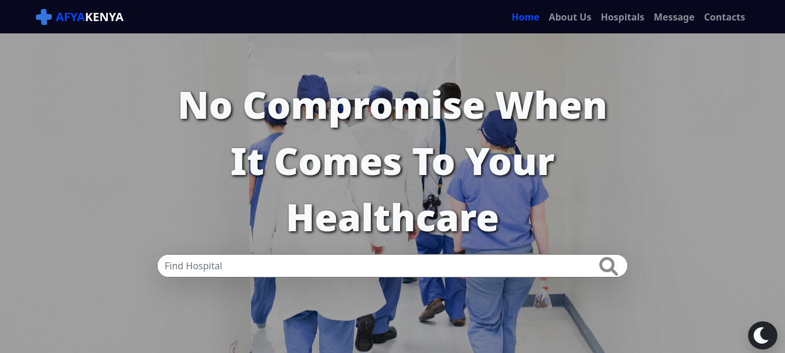

# AfyaKenya

## Table of Content

- [Description](#description)
- [Screenshot](#screenshot)
- [Installation](#install-requirements)
- [Technology Used](#technology)
- [License](#license)
- [Authors Info](#authors-Info)

## Description

The aim of this project is to assist its users in locating information on facilities and services offered by hospitals in Nairobi due to the past cases of patients receiving unsatisfactory health services.

## Screenshot

# 

## Install Requirements

- Computer

- Internet Access

- Git

- Terminal

## Installation

On your computer open terminal and run:

    git clone https://github.com/qurriahSam/afyaKenya.git

[Go Back to the top](#AfyaKenya)

## Technology

- Semantic HTML5 Markup - Has been used to build the structure of the page.

- CSS Custom properties - Has been used to style the landing page.

- JavaScript - Has been used to create the business logic.

- Bootstrap - Has been used for styling the navbar and other elements on the landingpage.

- JQuery - Has been used for javascript Functionality

## Links

- Live Site URL: [AfyaKenya](#)

[Go Back to the top](#AfyaKenya)

## Authors

- [Sam Kuria](https://github.com/qurriahSam)
- [Pauline Momanyi](https://github.com/Pauline-momanyi)
- [Catherine Otondi](https://github.com/catherineotondi)
- [Ann Wanjiru](https://github.com/annk1995)
- [Milcah Muraguri](https://github.com/Ngima-Muraguri)
- [Rose Kamau](https://github.com/Rose1200)
- [John Onyango](https://github.com/JohnKOnyango)

[Go Back to the top](#AfyaKenya)

## License

[MIT](./LICENSE) License.
